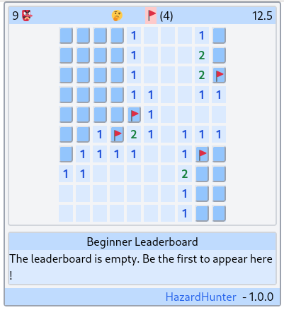

# Hazard Hunter

Hazard Hunter is a MineSweeper like game.

Play the game on [https://hazard-hunter.web-apps.top](https://hazard-hunter.web-apps.top)



## Start Hazard Hunter via the nix flake

To run an app (for instance the HazardHunter app) from the nix flake:

```
nix run github:web-apps-lab/HazardHunter
firefox http://127.0.0.1:8085
```

Or from the local checkout

```
nix run .#
firefox http://127.0.0.1:8085
```

## Hack on the code

```Shell
# Enter the nix develop shell
nix develop

# Start ghicd with
bin/run-ghcid

# Open the browser to get interactive feedback
firefox http://127.0.0.1:8085

# Run your code editor in the nix shell
code .
```